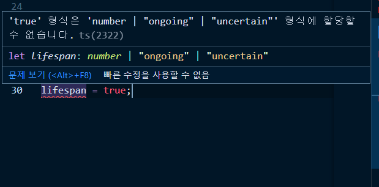

# 리터럴 타입

> 원티 타입 값 중 어떤 것이 아닌 특정 원싯값으로 알려진 타입

변수를 `const`로 선언하고 직접 리터럴 값을 할당하면 타입스크립트는 해당 변수를 할당된 리터럴 값으로 유추한다.

각 원시 타입은 해당 타입이 가질 수 있는 가능한 모든 리터럴 값의 조합으로 생각할 수 있다.(원시타입 = 해당 타입의 가능한 모든 리터럴 값의 집합)

`boolean`, `null`, `undefined` 타입 외의 모든 원시 타입에는 ***무한한 수의 리터럴 타입***이 있다.

| 원시타입             | 리터럴 값                                                    |
| -------------------- | ------------------------------------------------------------ |
| **boolean**          | `true` | `false`                                             |
| **null과 undefined** | 둘 다 자기 자신. 오직 하나의 리터럴 값 `null`, `undefined`   |
| **number**           | `0` | `1` | `2` ... | `0.1` | `0.2` \| ... 무한한 값         |
| **string**           | `""` | `"a"` | `"b"` | `"c"` | ... | `"aa"` | `"ab"` \| ... 무한한 값 |

유니언 타입 애너테이션에서는 리터럴과 원시 타입을 섞어서 사용할 수 있다.

`number | "ongoing" | "uncertain" ` 유니언 타입 변수에 `boolean` 타입은 할당할 수 없다.

또한 리터럴 타입은 서로 다른 리터럴 타입은 할당할 수 없다.

하지만 모든 리터럴 타입은 그 값이 해당하는 원시 타입에 할당할 수 있다. 모든 특정 리터럴 값의 집합이 곧 원시 타입이기 때문이다.

