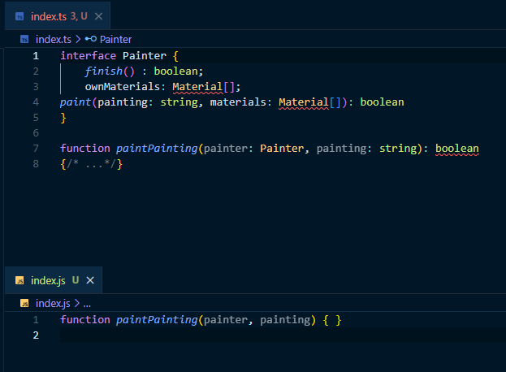

- TC 39 : 자바스크립트 운영위원회

> 해당 문서는 러닝 타입스크립트(조시 골드버그)를 학습하고 일부 정리한 내용입니다.


# 1장. 바닐라 자바스크립트의 함정

## 위험한 자유도

> 자바스크립트는 충돌 가능성 확인을 우선으로 하지 않는다.

```javascript
function paintPainting(painter, painting) {
    return painter
    .prepare()
    .paint(painting, painter.ownMaterials)
    .finish();
}
```

어떠한 맥락도 없이 위의 코드를 읽고 해석하는 것은 막연할 것이다. 추측한 가정이 맞더라도, 문자열이었던 `painting`이 다른 데이터 타입으로 변경되거나, 메서드 이름이 변경될 수도 있다.

자바스크립트는 충돌 가능성을 먼저 확인하지 않고 코드를 실행하는 동적(dynamic) 타입 언어이다.


## 부족한 문서(JSDoc의 한계)

> 자바스크립트 언어 사양으로는 함수의 매개변수, 함수 반환, 변수 등의 의미를 설명하지 못한다.

- JSDoc 표준 : 표준으로 형식화된 함수와 변수 코드 바로 위에 문서 주석을 작성하는 방식

```javascript
/**
* @param {Painting} painter
* @param {string} painting
* @returns {boolean} Whether the painter painted the painting.
*/
```

위와 같이 블록형 주석`/**/`를 활용하여 작성한다. 함수의 매개변수로 들어오는 값은 무엇인지, 함수가 반환하는 값의 타입은 무엇인지 등을 설명한다.


> 하지만 JSDoc은 한계가 있다.

- JSDoc 설명이 코드가 잘못되는 것을 막을 수는 없다.
- 복잡한 객체를 설명할 때는 다루기 어렵고, 장황해서 다수의 독립형 주석을 필요로 하게 된다.


# 타입스크립트

- 타입스크립트는 2010년대 초 마이크로소프트(MS) 내부에서 만들어졌다.
- 그 후 <u>2012년에 출시 및 오픈소스화</u>되었다.


> 타입스크립트란

- **프로그래밍 언어** : 자바스크립트의 모든 구문과 타입을 정의하고 사용하기 위한 새로운 타입스크립트 고유 구문이 포함된 언어
- 타입 검사기 : 자바스크립트 및 타입스크립트로 작성된 일련의 파일에서 생성된 모든 구성 요소(변수, 함수 등)를 이해하고, 잘못 구성된 부분을 알려주는 프로그램
- **컴파일러** : 타입 검사기를 실행하고 문제를 보고한 후 이에 대응되는 자바스크립트 코드를 생성하는 프로그램
- 언어 서비스 : 타입 검사기를 사용해 VS Code과 같은 편집기에 개발자에게 유용한 유틸리티 제공법을 알려주는 프로그램 


## 타입스크립트를 사용해야 하는 이유

> 타입스크립트를 사용하면 매개변수와 변수에 제공되는 값의 타입을 지정할 수 있다. 

코드를 지정한 방법으로만 사용하도록 '제한'한다면, 타입스크립트는 코드의 한 영역을 변경하더라도 이 코드를 사용하는 다른 코드 영역이 멈추지 않는다는 확신을 줄 수 있다.

예를 들어, 함수의 개수를 두 개에서 한 개로 변경했을 때 변경된 함수를 호출하는 코드를 업데이트 하지 않았다면, 타입스크립트가 알려준다.

(자바스크립트에서는 인수의 개수를 변경된 1개가 아닌 2개로 전달해도 오류가 발생하지 않는다.)

코드를 입력할 때 편집기에서 간단한 오류를 미리 알려주면, *<u>코드를 실행하고 오류가 발생할 때까지 기다리는 것보다 훨씬 유용하다.</u>*


> 타입스크립트를 사용하면 코드를 문서화할 수 있다.

`paintPinting` 함수의 타입스크립트 버전은 다음과 같다.

```typescript
interface Painter {
    finish() : boolean;
    ownMaterials: Material[];
    paint(painting: string, materials: Material[]): boolean;
}

function paintPainting(painter: Painter, painting: string) {
    return painter
    .prepare()
    .paint(painting, painter.ownMaterials)
    .finish();
}
```

객체 `Painter`의 타입을 문서화함으로써, `Painter` 에는 속성이 세 개가 있고, 그 중 두 가지는 메서드라는 것을 이해할 수 있게 된다. 타입스크립트는 **구문**을 적용해 <u>*객체의 형태를 설명하고, 객체가 어떻게 보이는지를 설명한다.*</u>


# 🏷 1장 후기

자유로운 자바스크립트의 위험도를 깨닫게 되었다. 

타입스크립트를 처음 접한 건 원티드 프리온보딩 프론트엔드 3월 특강에서 사용되었던 교안의 예제 코드였다. 처음엔 난무하는 타입과 `|` 연산자와 `null`과 `interface`에 정신을 못 차리고 겁 먹었는데, 사실 그들은 친절하게 설명해준 것이었다. 1장을 공부하고 나니 타입스크립트는 더욱 친절함을 더해주는 프로그래밍 언어라는 생각이 들었다.

코드를 문서화할 수 있다는 점이 가장 매력적인 것 같다. 그리고 결국 타입스크립트는 자바스크립트로 컴파일되는데, 그 두 파일을 같이 보니까 신기하고 재밌었다.

새로운 프레임워크, 메서드 등을 학습할 때 반환 값이 무엇인지 설명되어있는 API문서들은 매우 유용하다. 

또한, 개발하면서 마주치는 오류들 중에는 return값이 무엇인지 미리 알았다면 피할 수 있던 간단한 오류가 꽤 많다. 

타입스크립트는 코드를 문서화할 수 있으니, 이후 유지보수, 리팩토링 시에 코드를 다시 들여다보더라도 맥락을 제대로 파악하게 해 주는 것 같아서 앞으로 타입스크립트를 공부할 날이 기대된다.


첫 번째 타입스크립트



