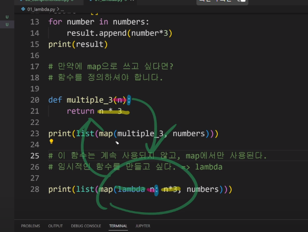

파이썬 응용/ 심화(Technical Fuction)

# List Comprehension

> 특정한 원소(요소)로 구성된 리스트를 만들 때 작성하는 코드

1~3의 세제곱의 결과가 담긴 리스트를 만드시오.

1부터 3까지 반복하면서 세제곱이 되는 결과는 count 리스트에 담기

number**3


리스트 컴프리헨션을 사용하면?!

짜잔 number**3 for number in ragne(1,4)


for number in ragne(1,4)

.append 햇던 부분을

number**3로 가져올 수 있음.

특정한 원소(요소)로 구성된 리스트를 만들 때 작성하는 코드

=>List Comprehension

## # 홀짝으로 더하고 빼는 문제

number = [0, 1, 2, 3]

evne_list=[for i in range(1) if i % 2 == 0]

print(even_list) List Comprehension은 코드를 확 줄여준다.

# Dictionary Comprehension

{number: number**3 for number in range(1, 4)}

키 : 값

# lamda 람다함수

>  이름이 없는 함수여서 익명함수


numbers = [1, 2, 3, 10, 3, 9, 12]

result = []

```python
for number in numbers:

    if number  % 3 == 0:

        result.append(number)

prin(result)
```

임시적인 함수를 만들고 싶다. => lamda

lamda input:output

print(list(map(lamda n: n*3, numbers)))

# filter

- 3의 배수인 리스트로만 만들기
- filter(lamda n : n % 3 == 0, numbers)
- <filter object> 의 형태로 출력
- def is_3(n):

​					return n % 3 == 0

# 파이썬의 버전

> 우리가 배운 것이 작동 안 할 일은 없는데 버전이 다를 수 있으니 최신 문법이 무조건 좋은 것만은 아니다.

- 파이썬은 동적언어
- 함수 어노테이션? 함수 주석 = 쪽지만, 힌트 제공
- 동적 타입 언어인 파이썬에서 
- 정적 타입으로 바꿔주는 게 아니라
- 그냥 힌트만(메모)

```python
# 변수 어노테이션
a : int = 3

print(a)

# 함수 어노테이션
def and(x : int, y: int) -> int: # 인트끼리 인트를 더하면 인트가 나올거예요
    return x + y

print(add(7, 4)) # 11
print(add('hi', 'hello')) # 'hi hello' 정상 출력됨. 그냥 힌트만 준거예요
```


# 모듈 심화

다양한 파일들이 하나의 폴더로 

pip 모듈을 관리하는 관리자(파이썬 패키지 관리자)


# 가상환경

복수의 프로젝트를 하는 경우 버전이 상이할 수 있음

가상환경을 마들어 프로젝트별로 독립적인 패키지를 관리할 수 있음


